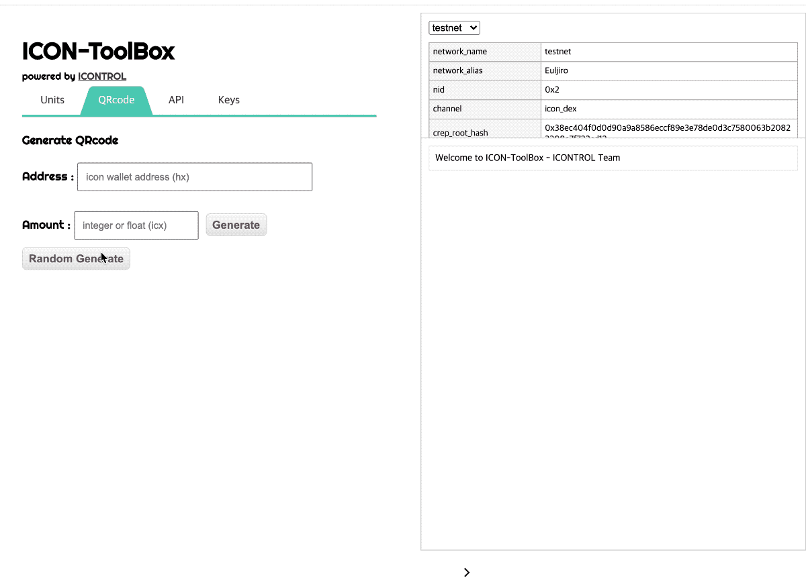

##icon-toolbox

This tool is intended to help developers develop.  
All functions are implemented in javascript and can be executed without a server.
   

###Support functions
1. Generate to QR-CODE
2. Unit Converter 
    > Number <-> Hex  
    Unixtime <-> Hex  
    text <-> base64  

3. Call ICON's API
    > getIISSinfo , icx_getTotalSupply, icx_getLastBlock, icx_getBalance  
    icx_getTransactionResult, icx_getTransactionByHash  
    icx_getBlockByHeight

4. Key generator

### How to build

`npm install --save`
`npm run build`
`npm start`
