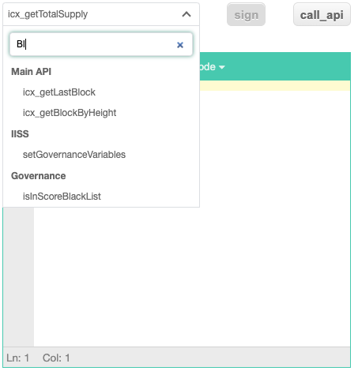

## icon-toolbox

[](http://icontrol.id)


This tool is intended to help developers develop. <br>
All functions are implemented in javascript and can be executed without a server.
   

### Supported functions
1. Generate to QR-CODE
2. Unit Converter 
    > Number <-> Hex <br>
    Unixtime <-> Hex <br>
    text <-> base64 <br>

3. Call ICON's API
    > `icx_getTotalSupply` , `icx_getLastBlock`, `icx_getBalance`, `icx_getTransactionResult` <br>
    `icx_getTransactionByHash`, `icx_getBlockByHeight` <br>
    `icx_sendTransaction`, `setStake`  ...

    > Post data is created using `axios` and then transmitted. Supported APIs will be added. <br>
    You can change the network settings through selectbox.
                                  
    > Search is possible and all methods are supported. 
    > https://www.icondev.io/docs/governance-score-apis, https://www.icondev.io/docs/icon-json-rpc-v3
                                                                                                                                                                                           

4. Key generator
    > Store the keystore file in localStorage of Browser.
    > It's not unloaded anywhere.<br>
    > You can create a transaction by signing based on the selected key.

### How to settings
1. network setting
You can set the network, you can also test while the network.
It is possible to define additional users in addition to the values of (mainnet, testnet, bicon, zicon) which are basically set.
   

2. KeyStore  setting
You can create a transaction after importing the keystore file.
   

### How to build

```bash
$ npm install --save
$ npm run build
$ npm start

```


### Reference

https://www.icondev.io/docs/icon-json-rpc-v3
